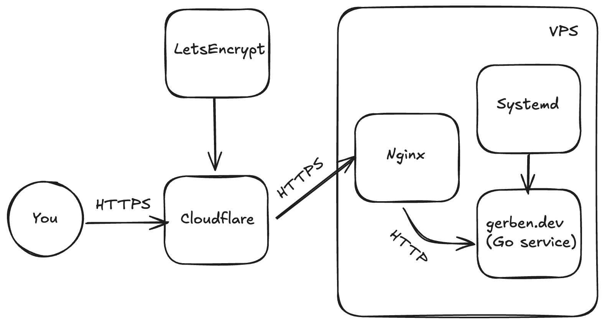

# gerben.dev infra

My website **gerben.dev** runs on a VPS, as a Go service on port 8000. 
It is served by nginx, which is configured to listen on port 80 and 443. 
The website is served over HTTPS using a Let's Encrypt certificate.
To handle server restarts and crashes, I use systemd to manage (and restart) the service.

In this folder you can find some of the configuration files I use to run my website.
They're meant as a learning resource and not necessarily as a guideline.

